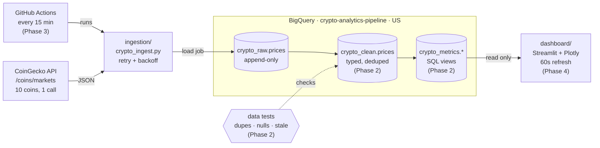

# Architecture

- Logic lives in SQL. The dashboard only reads `crypto_metrics` views.
- Auth: local runs and Actions both use the `crypto-pipeline-sa` service account.
  - Locally, the key file is at `%USERPROFILE%\.gcp\crypto-pipeline-sa.json` and `GOOGLE_APPLICATION_CREDENTIALS` points to it.
  - In Actions, the key comes from the `CRYPTO_GCP_KEY` secret.
